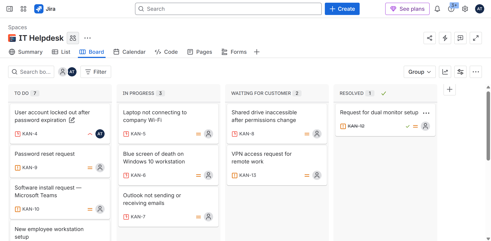
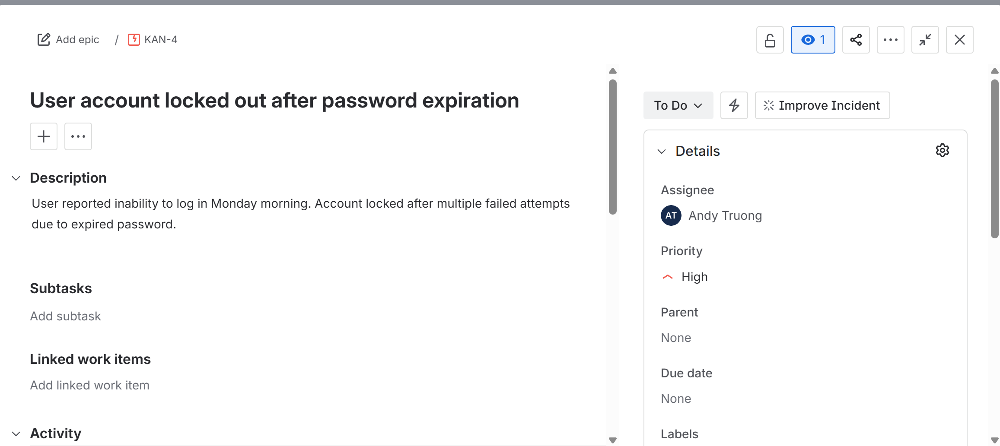
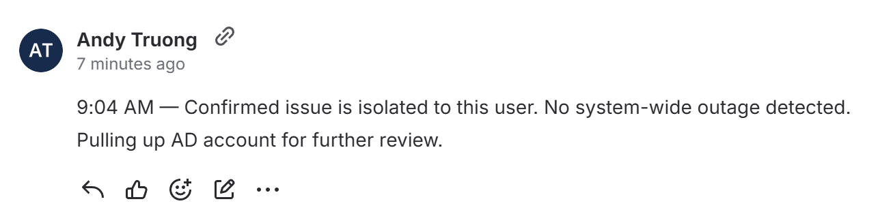
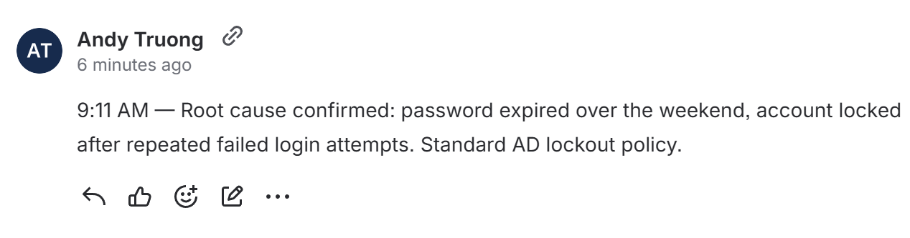
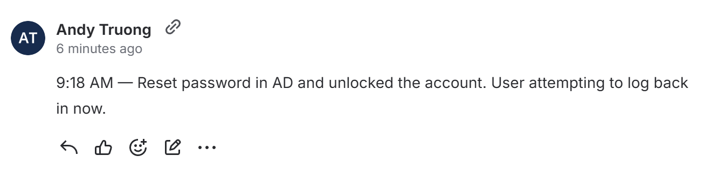
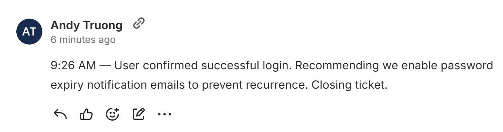
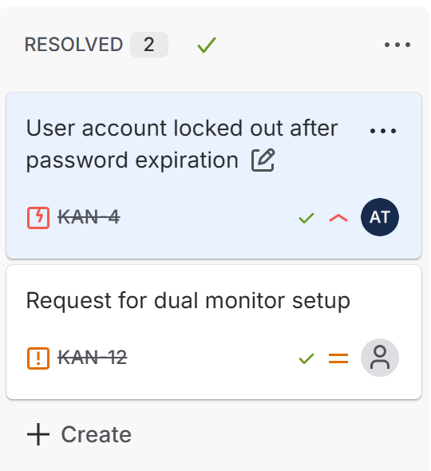

# KAN-4: User Account Locked Out After Password Expiration

| | |
|---|---|
| **Incident** | User unable to log in after password expiration |
| **Severity** | High. Blocked from critical work |
| **Root Cause** | Password expired + AD account locked after failed attempts |
| **Status** | Resolved. Same-day fix |
| **Environment** | Corporate IT environment, March 2026 |

---

## Overview

Marcus couldn't log in to his workstation Monday morning. The system locked him out after the weekend, and he had critical work waiting. The fix itself was simple: reset the password, unlock the account. But the process around that fix is what this case study is about. Scope check, root cause, verification, and a prevention note so it doesn't happen again.

---

## The Incident

Monday morning, Marcus reported he couldn't log in to his workstation. The system locked him out, and he had immediate work to do. I opened the ticket in Jira, classified it as an Incident, set it High priority, and got to work.

**Supporting screenshots:**

---

## Diagnosis Process

First thing I needed to rule out: was this just Marcus, or was the whole domain having problems?

**Scope Check**

I verified that other users could log in fine and that Marcus's workstation was on the network with an active account. That ruled out a system outage or a general network problem. The issue was specific to Marcus.

**Diagnosis screenshot (9:04 AM):**

**Root Cause**

I pulled up Active Directory and checked the password policy. The answer was clear: Marcus's password had expired Friday, and the account locked after too many failed login attempts Monday morning. Standard AD behavior, nothing malicious.

**Root cause screenshot (9:11 AM):**

---

## Resolution & Closure

With the root cause confirmed, the fix was straightforward. I reset the password in Active Directory and unlocked the account. Then I had Marcus test the login immediately.

**Why this didn't bounce back:** I didn't just fix it and move on. I waited for Marcus to confirm access was restored before closing the ticket. That extra step is the difference between resolved and reopened.

**Prevention:** I documented a recommendation to enable password expiry notification emails so users get warned before the deadline, not locked out after. Without that note, this same call comes back in three months. That's the difference between closing a ticket and actually solving the problem.

**Resolution screenshots (9:18 AM to 9:26 AM):**

---

## What This Taught Me

Ten minutes of actual work. Password reset, account unlock, done. But the way I got there is the whole point.

**Documentation is the job.** Scope check, root cause, fix, verification. Every step logged as it happened. If someone else had to pick this up mid-way through, or if it came back in a review six months later, the activity log tells the whole story.

**Don't just close it, solve it.** The ticket is done when the user is back online. The job is done when you've documented why it happened and what stops it from happening again.

---

## Lab Context: The Jira Board Setup

This case study sits inside a broader IT Helpdesk lab. The foundation is a Kanban board with four columns (To Do, In Progress, Waiting for Customer, Resolved) and three ticket types:

- **Incidents**: Break-fix issues that need to move now
- **Service Requests**: Planned work like installs, new setups, or access requests
- **Tasks**: Internal IT items like audits or documentation

The queue below shows what a realistic helpdesk queue looks like. Multiple incidents at different stages, service requests waiting for approval, and background tasks that keep the system running.

| Ticket | Summary | Type | Status |
|--------|---------|------|--------|
| KAN-4 | User account locked out after password expiration | Incident | Resolved |
| KAN-5 | Laptop not connecting to company Wi-Fi | Incident | In Progress |
| KAN-6 | Blue screen of death on Windows 10 workstation | Incident | In Progress |
| KAN-7 | Outlook not sending or receiving emails | Incident | In Progress |
| KAN-8 | Shared drive inaccessible after permissions change | Incident | Waiting for Customer |
| KAN-9 | Password reset request | Service Request | To Do |
| KAN-10 | Software install request, Microsoft Teams | Service Request | To Do |
| KAN-11 | New employee workstation setup | Service Request | To Do |
| KAN-12 | Request for dual monitor setup | Service Request | Resolved |
| KAN-13 | VPN access request for remote work | Service Request | Waiting for Customer |
| KAN-14 | Update antivirus definitions on all workstations | Task | To Do |
| KAN-15 | Audit user accounts in Active Directory | Task | To Do |
| KAN-16 | Document onboarding IT checklist | Task | To Do |

---

## Tools & Technologies Used

| Tool | Purpose |
|---|---|
| **Jira** | Organizing and tracking incidents from report to resolution |
| **Active Directory** | Managing user accounts, security groups, and password policies |
| **Kanban board** | Visualizing ticket lifecycle and queue prioritization |
| **ITSM methodology** | Structuring incident response (Intake → Scope → Root Cause → Resolution → Closure) |

---

*Case Study | Lab Simulation | March 2026*
